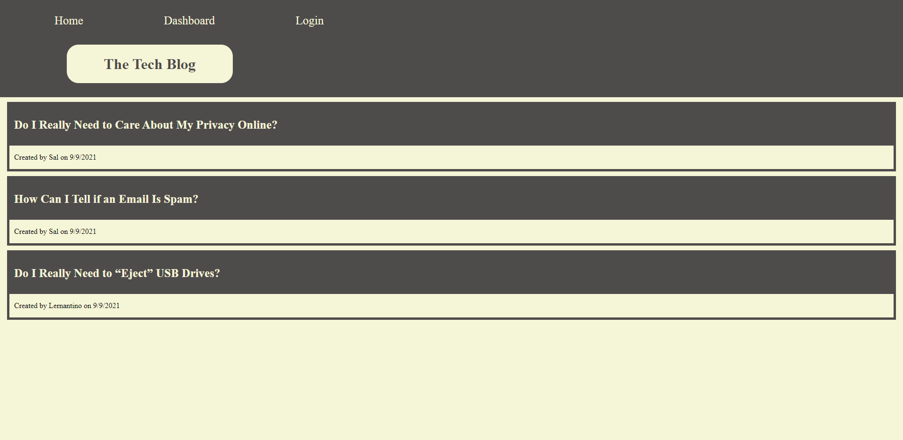
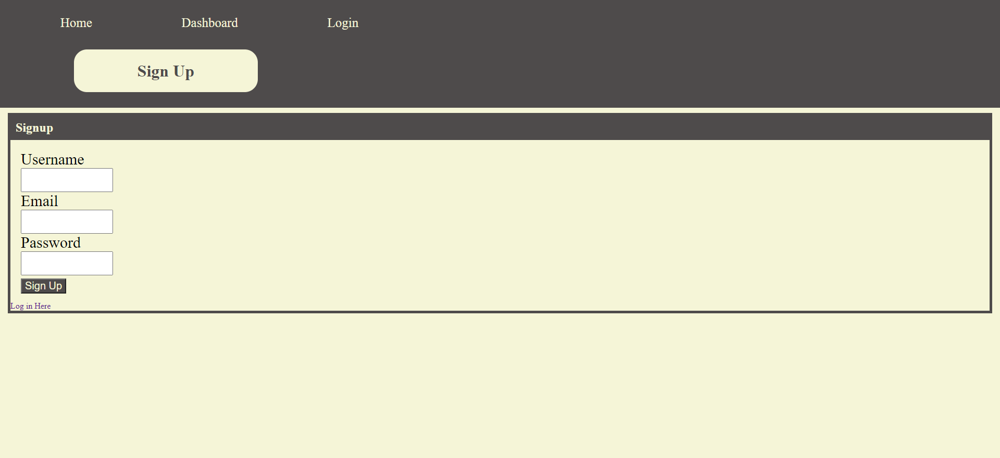
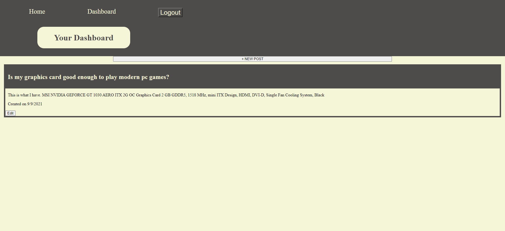
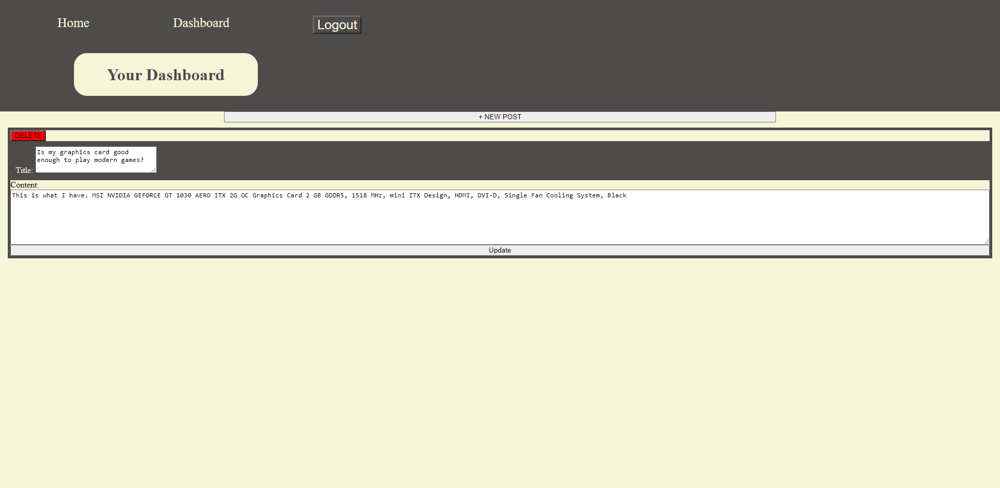
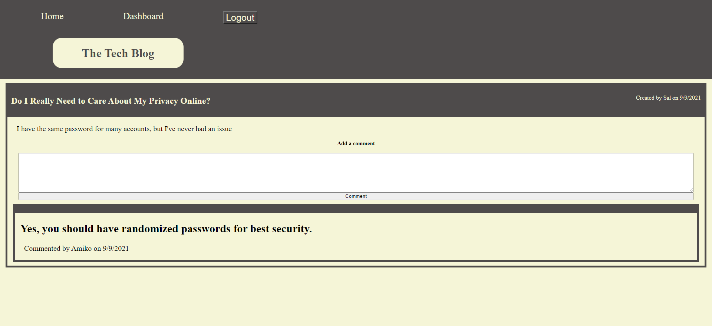

# Tech-Blog
  ## 

  ## Description
  A web application that allows a user to make an account and log in, view all posts, comment on posts, and create, edit and delete posts. This application is hosted by Heroku. This is intended for users looking for tech help where they can ask questions and recieve feedback about tech. 
  
  The application is hosted on a server and uses many node modules to make the development easier, including: Express, Express-Session, Express-Handlebars, MySQL2, Sequelize, Connect-Session-Sequelize, Bcrpt, and Dotenv. It is a fully functional web page with front end javascript allowing interaction with the page, while fetching requests from the API to make edits on the backend, storing the data on a database.
  
  While creating this app, I used MySQL to source my schema database, Node.js to run the server javascript file which makes my data live and editable.

  ## Table of Contents
  * [Installation](#installation)
  * [Usage](#usage)
  * [License](#license)
  * [Contributing](#contributing)
  * [Questions](#questions)
  
  ## Installation
  To install Node.js, follow the documentation [Node.js](https://coding-boot-camp.github.io/full-stack/nodejs/how-to-install-nodejs)

  To install MySQL, follow the documentation [MySQL](https://dev.mysql.com/downloads/installer/)

  To install necessary dependencies, run the following command: 
  ```
  npm i
  ```
  
  ## Usage
  Access the webpage by going to the deployed site: [Tech Blog](https://infinite-dusk-29227.herokuapp.com/). 
  
  Test Account: test2@email.com Password: !t3stmyPw0rd

  If you want to run this on a local server, set the path to the Model-View-Controller-MVC-Tech-Blog folder in the terminal and log in to MySQL and source the schema.sql by running `source db/schema.sql`. Run `Node seeds/seed.js` to source the seeds folder, if you want preset data.  Then run the server.js file by typing `node server.js`. Go to http://localhost:3001 to acesss the site.

  
  
  
  
  

  ## License  
  This project is licensed under the terms of the [MIT License](https://opensource.org/licenses/MIT).

  ## Contributing
  I am the sole author of this repo and I am not currently looking for contributors.


  ## Questions
  If you have any questions about the repo, open an issue or contact me directly at Gaitherdb@gmail.com. You can find more of my work at [Gaitherdb](https://github.com/Gaitherdb).
